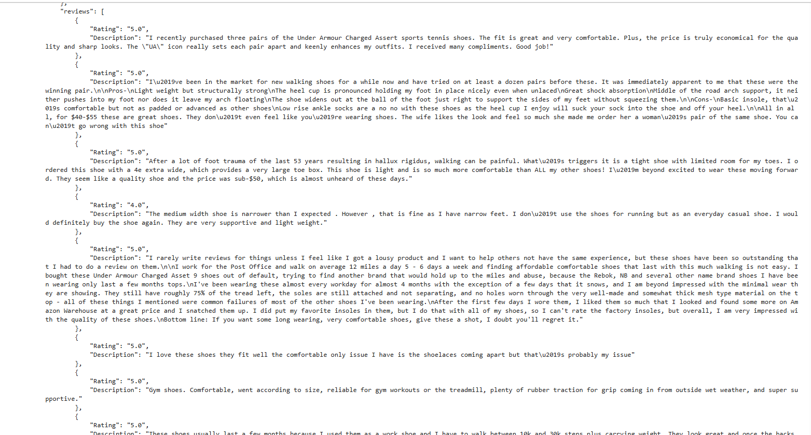
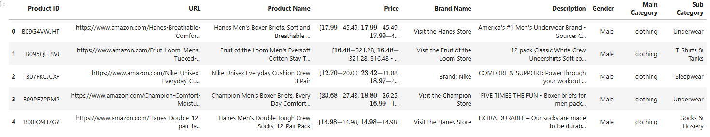

# Amazon Web Scraper Project

### Overview
In this project, I successfully scraped data from Amazon, collecting information on over 10,000+ products, each accompanied by 500+ reviews, multiple product images, and detailed product descriptions. The scraper is designed to handle multiple product categories, gathering comprehensive details for each product such as pricing, reviews, and product variations.

### Features
- Scraped over **10,000 products** from various categories.
- Collected **200+ reviews** per product.
- Extracted **multiple images** per product with pricing for each variation (e.g., color, size).
- Gathered **detailed product descriptions** and specifications.

---

### 1. Category, Product URL, Product Name, and Price

This image shows the following scraped data:
1. **Category of the product** 
2. **Product URL**
3. **Product Name and Price**

---

### 2. Product Images and Pricing for Each Variation

This image demonstrates the ability to scrape:
1. **Multiple images** of each product
2. **Pricing information** for each product variation (e.g., different colors)

---

### 3. Total Reviews and Scraped Reviews for Each Product

This image includes:
1. **Total number of reviews** available for the product
2. Scraped **500+ reviews** for each product

---

